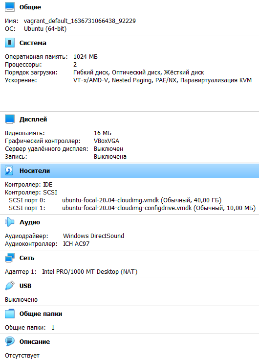
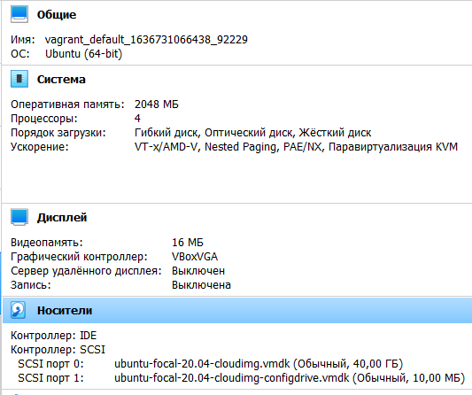

1. VirtualBox установлен  
2. Vagrant установлен  
3. Используемый терминал - Windows Terminal  
4. Создана рабочая директоря Vagrant. 
 - Инициализирован командой "vagrant init ubuntu/focal64". Дистрибутив Ubuntu 20.04LTS Focal Fossa  
 - Команда "vagrant up" вне зависимости от дистрибутива не видела ни один box до тех пор пока в Vagrantfile не был добавлен параметр "config.vm.box_download_insecure = true", после чего все скачалось и запустилось. По команде "vagrant ssh" успешно произведен вход в консоль (по умолчанию реквизиты для входа vagrant/vagrant)  
 - Команда 'vagrant suspend' успешно останалвивает вирт.машину с сохранением состояния, о чем есть подтверждение в GUI VirtualBox. Команда 'vagrant halt' выключила машину штатным методом ОС.  
5. С GUI ознакомился, по умолчанию вирт.машине выделены следующие ресурсы:  

6. С докуменгтацией по vagrantfile ознакомлен. Для того, чтобы добавить в машину памяти или ресурсов процессора нужно добавить/изменить в vagrantfile секцию "config.vm.provider":  
config.vm.provider "virtualbox" do |v|  
  v.memory = 1024  
  v.cpus = 2  
end  
где memory - объем ОЗУ  
    cpus   - кол-во процессоров  
изменено на 2048/4:  
  
7. Командой vagrant ssh удалось подключиться к в.м. ubuntu 20.04. Обсуждаемые на курсе команды вводятся, ознакомлен.  
8. Ознакомился с разделами документации bash (man bash).  
- Длина журнала истории команд настроивается в переменной HISTFILESIZE в строке 619 man bash (GNU bash, version 5.0.17(1)-release (x86_64-pc-linux-gnu)) и переменной HISTSIZE (строка 628 man).   
- директива ignoreboth является одним из значений переменной HISTCONTROL которая настраивает механизм сохранения команд в истории. ignoreboth используется для объединения значений ignorespace и ignoredups для пропуска записи команд в историю, начинающихся с пробела и дублирующихся команд bash. 
9. Использование фигурных скобок в скриптах bash:
- Для выполнения команд группой {команда1 ; команда2 ;} текущем сеансе оболочки. (строка 205 man). 
- Для подстановки переменных и массивов с различными условиями и шаблонами ${переменная}, ${переменная:-значение}, ${переменная#шаблон} и т.д.  
- В различных условных циклах, условных операторах, для ограничения тела функции
- Для раскрытия списка значений или диапазона, например touch {file1, file2, file3} или touch file{01..10}.txt (строка 791 man 'Brace Expansion'). 
